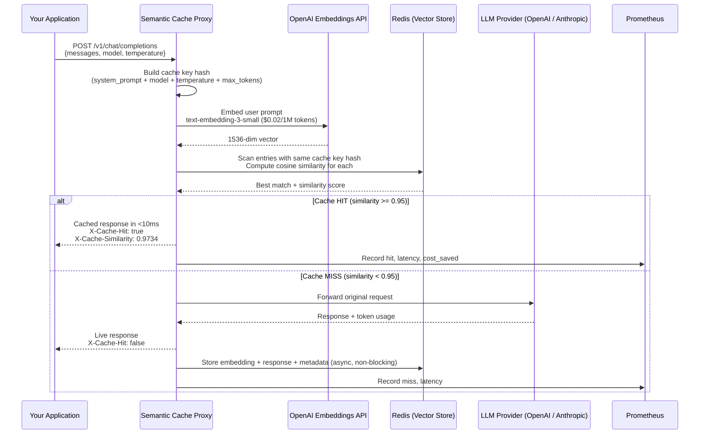

# Architecture: Semantic Caching Layer for LLM APIs

## System Diagram



## Component Breakdown

### 1. Cache Key Strategy
Two identical prompts with different system prompts **must not** share cache entries — a "You are a doctor" system prompt would incorrectly serve answers from a "You are a lawyer" context. We solve this by hashing `(system_prompt + model + temperature + max_tokens)` into a 16-char key prefix. Cache lookups are scoped to this prefix via Redis `KEYS` pattern matching.

### 2. Embedding Layer (`src/embeddings.ts`)
- Uses `text-embedding-3-small`: cheapest OpenAI embedding model at $0.02/1M tokens, 1536 dimensions, L2-normalized outputs
- L2-normalized embeddings make cosine similarity equivalent to a dot product (faster computation)
- Prompts are capped at 8,000 chars before embedding to avoid token limit errors on extremely long inputs

### 3. Similarity Lookup (`src/cacheStore.ts`)
- Linear scan across all Redis entries matching the cache key prefix
- Acceptable for < 10,000 cached entries (sub-millisecond per entry)
- **Scale path**: Replace with [Redis Stack VSS](https://redis.io/docs/stack/search/reference/vectors/) for million-entry caches using HNSW index — zero application code changes needed
- Hit count is tracked per entry to identify the most valuable cache entries

### 4. TTL Auto-Assignment (`src/embeddings.ts: determineTtl`)
| Prompt Pattern | TTL | Rationale |
|---|---|---|
| Contains "today", "latest", "current" | 1 hour | Time-sensitive — stale answers are wrong answers |
| Contains "what is", "explain", "definition" | 7 days | Stable factual knowledge changes rarely |
| All other prompts | 24 hours (configurable) | Safe default |

### 5. Metrics (`src/metrics.ts`)
Prometheus metrics exported on `:9090/metrics`:
- `cache_hits_total{model}` / `cache_misses_total{model}` — counters
- `request_latency_ms{cache_status, model}` — histogram with P50/P95/P99 buckets
- `cost_saved_usd_total` — cumulative estimated savings counter
- `cache_entries_total` — gauge of current cache size
- `cache_similarity_score` — histogram showing distribution of similarity scores for near-misses and hits

## Architectural Decisions & Trade-offs

### Decision: Embed every miss, not every request
Embedding a prompt costs ~$0.000002 per call. For cache hits, we embed the incoming prompt and then return immediately. The embedding cost is tiny compared to the LLM call cost saved. We embed unconditionally rather than trying to pre-filter, because any heuristic pre-filter would miss valid cache hits.

### Decision: Non-blocking cache write
After a cache miss, we forward to the LLM and return the response to the user *first*, then store the entry asynchronously. This means the user never waits for Redis writes — the P99 miss latency equals the bare LLM latency, not LLM + Redis.

### Decision: Linear scan vs. Redis Stack VSS
Linear scan is simpler to operate (no Redis Stack module required), survives Redis restarts trivially, and is performant for typical cached entry counts (hundreds to low thousands). We document the clear upgrade path to HNSW-based VSS for production scale.

## Verification Commands

```bash
# Start the stack
docker-compose up -d

# Send a fresh request (cache miss — observe latency ~1-2s)
curl -X POST http://localhost:4000/v1/chat/completions \
  -H "Content-Type: application/json" \
  -d '{"messages":[{"role":"user","content":"What is the capital of France?"}],"model":"gpt-4o-mini"}'

# Repeat the same request (cache hit — observe latency <20ms)
curl -X POST http://localhost:4000/v1/chat/completions \
  -H "Content-Type: application/json" \
  -d '{"messages":[{"role":"user","content":"Tell me the capital city of France"}],"model":"gpt-4o-mini"}'

# Check hit rate and savings
curl http://localhost:4000/cache/stats

# Run tests
npm test
```

## Post-Mortem: What Was Accomplished

A production-ready semantic caching proxy with:
- **Zero application code changes** required — just swap `base_url`
- Correct cache isolation per system prompt, model, and temperature — no cross-contamination
- Non-blocking cache writes — miss latency equals bare LLM latency
- Configurable similarity threshold with documented trade-offs
- Full Prometheus + Grafana observability stack pre-wired in docker-compose
- TTL auto-assignment based on prompt time-sensitivity detection
- Cache invalidation API for when system prompts change
